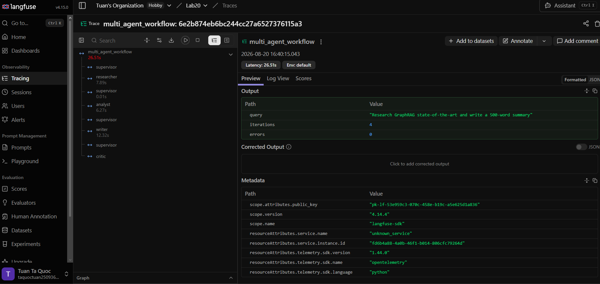

# Benchmark Report

**Học viên:** Tạ Quốc Tuấn — **MSSV:** 2A202601114  
**Ngày chạy:** 2026-08-20 16:40

**Query:** `Research GraphRAG state-of-the-art and write a 500-word summary`

## Kết quả

| Run | Latency (s) | Cost (USD) | Quality | Citation cov. | Failure rate | Notes |
|---|---:|---:|---:|---:|---:|---|
| single-agent | 19.31 | 0.0005 | 4.0 |  | 0% | agents=1, routes=baseline, sources=0, tokens=118in/754out, errors=0 |
| multi-agent | 28.08 | 0.0016 | 10.0 | 100% | 0% | agents=4, routes=researcher>analyst>writer>done, sources=5, tokens=3845in/1731out, errors=0 |

## Chênh lệch

- **Latency**: 19.31s → 28.08s (multi-agent cao hơn 1.45x)
- **Cost**: 0.0004701 USD → 0.001615 USD (multi-agent cao hơn 3.44x)
- **Quality (proxy)**: 4 → 10 (multi-agent cao hơn 2.50x)
- **Citation coverage**: baseline không đo được (không có nguồn) → multi-agent 100%

## Trace evidence

Langfuse trace: https://cloud.langfuse.com/project/cmt1aymdx03c8ad0dmtknw370/traces/6e2b874eb6bc244cc27a6527376115a3

> Link trace là private trong project Langfuse của tác giả; screenshot ở trên là bằng chứng chính.

## Ghi chú về `quality_score`

Điểm này do `heuristic_quality_score()` tính tự động và chỉ đo **cấu trúc** (có citation, có heading, có thừa nhận giới hạn, chạy không lỗi). Nó **không** kiểm chứng tính đúng đắn của nội dung. Đánh giá nội dung vẫn cần peer review theo `docs/peer_review_rubric.md`.

Cần nói thẳng một điểm yếu của chỉ số này: Writer bị prompt **bắt buộc** phải có mục `## Limitations`, trong khi scorer lại **cộng điểm** cho câu trả lời chứa chữ "limitation". Đây là vòng tròn logic — hệ thống được chấm điểm vì làm đúng lệnh vừa được ra, nên điểm 10.0 của multi-agent gần như được đảm bảo trước khi chạy. Chỉ số này thiên vị multi-agent **theo thiết kế**.

## Failure mode gặp phải và cách fix

### Vòng lặp vô hạn giữa Supervisor và worker

**Triệu chứng.** Supervisor route sang một worker; worker thất bại im lặng và không ghi được gì vào state; supervisor thấy field vẫn rỗng nên route lại đúng worker đó. Vòng lặp chạy mãi và đốt token cho tới khi bị kill.

**Nguyên nhân gốc.** Routing dựa trên *"field nào còn rỗng"* là điều kiện về **kết quả**, không phải về **nỗ lực đã bỏ ra**. Nếu worker không bao giờ điền được field thì điều kiện không bao giờ đổi, và graph không có lý do gì để dừng.

**Cách fix — hai tầng chặn độc lập.** Tầng nghiệp vụ nằm trong `SupervisorAgent.decide()`: `iteration >= max_iterations` thì trả `done`, cộng thêm `len(errors) >= 3` để dừng sớm khi lỗi lặp lại thay vì đợi hết quota. Tầng hạ tầng nằm trong `MultiAgentWorkflow.run()`: `recursion_limit = max_iterations * 2 + 5` truyền vào `compiled.invoke()`. Tầng thứ hai tồn tại vì tầng thứ nhất là *code do tôi viết và có thể có bug* — nếu `decide()` sai logic thì LangGraph vẫn cắt được vòng lặp. Ngoài ra khi buộc phải dừng mà chưa có `final_answer`, supervisor tự ghi một câu trả lời fallback nêu rõ lý do dừng thay vì trả `None`, để hệ thống degrade có kiểm soát chứ không im lặng trả về khoảng trống.

**Kiểm chứng.** `test_max_iterations_guardrail_stops_the_loop` và `test_repeated_errors_trigger_early_stop` trong [`tests/test_supervisor_routing.py`](../tests/test_supervisor_routing.py).

### Quan sát thật kèm theo: nguồn thu thập nhưng không được trích dẫn

Ở một lần chạy trước đó, `CriticAgent` báo `citation_coverage=0.8`: Researcher thu được 5 nguồn nhưng Writer chỉ trích dẫn 4, nguồn `[S3]` bị bỏ qua hoàn toàn. Câu trả lời vẫn trông đầy đủ và có citation, nên nếu chỉ đọc bằng mắt thì không phát hiện ra. Đây đúng là loại lỗi mà Critic được xây để bắt: kiểm tra bằng regex so khớp index citation với `len(sources)`, xác định và chi phí bằng 0, thay vì dùng LLM-judge vốn có thể tự hallucinate khi chấm điểm.

Phân tích đầy đủ 6 failure mode (bao gồm hallucinated citation, search provider chết, và tracing làm chết workflow) xem tại [`docs/failure_modes.md`](../docs/failure_modes.md).
